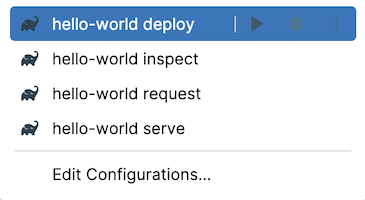

[example]: https://github.com/manriif/supabase-edge-functions-kt-example

# Supabase Edge Functions Kotlin

Build, serve and deploy Supabase Edge Functions with Kotlin and Gradle.

The project aims to bring the ability of writing and deploying Supabase Edge Functions using Kotlin
as primary programming language.

[]()
[](http://kotlinlang.org)
[](https://kotl.in/jsirsupported)
[]()
[](https://search.maven.org/artifact/org.jetbrains.dokka/io.github.manriif.supabase-functions)
[](https://plugins.gradle.org/plugin/io.github.manriif.supabase-functions)
[](https://choosealicense.com/licenses/mit/)
[](https://kotlinlang.slack.com/archives/C06QXPC7064)

## Get started

It is recommended to use your favorite IntelliJ based IDE such as IntelliJ IDEA or Android Studio.

Also, it is recommended to have one gradle subproject per function.
Inspiration on how to structure your gradle project can be found in the [example][example].

### Gradle setup

If you plan to write multiple functions, declare the plugin in the root build script:

```kotlin
plugins {
    id("io.github.manriif.supabase-functions") version "0.0.1" apply false
}
```

Apply the Gradle plugin in the build script of your project:

```kotlin
plugins {
    id("io.github.manriif.supabase-functions")
}

supabaseFunction {
    packageName = "org.example.function" // Required, package of the main function
    functionName = "my-function" // Optional, default to the project name
    supabaseDir =
        file("supabase") // Optional, default to a `supabase` directory in the root project 
    envFile = file(".env.local") // Optional, default to supabaseDir.file(".env.local")
    projectRef = "azertyuiopsdfghjklw" // Optional, no default value
    importMap = false // Optional, default to true
    verifyJwt = false // Optional, default to true
}
```

### Kotlin/JS setup

Apply the Kotlin Multiplatform plugin in the build script of your project:

```kotlin
plugins {
    id("org.jetbrains.kotlin.multiplatform")
}

kotlin {
    js(IR) {
        binaries.library() // Required
        useEsModules() // Required
        nodejs() // Required
    }
}
```

### Main function

An [example][example] repository is available
to get you started faster.

The only requirement for the magic to work is to write an entry function that accepts a
single `org.w3c.fetch.Request` parameter and returns a `org.w3c.fetch.Response`.

The function can be marked with suspend modifier.

In any kotlin source file of your project (function):

```kotlin
// src/jsMain/kotlin/org/example/function/serve.kt
package org.example.function

suspend fun serve(request: Request): Response {
    return Response(body = "Hello, world !")
}
```

### Run configuration

After a successful gradle sync and if you are using an IntelliJ based IDE, you will see new run configurations for your function.

<picture>
  <source media="(prefers-color-scheme: dark)" srcset="./docs/run_config_dark.png">
  <source media="(prefers-color-scheme: light)" srcset="./docs/run_config_light.png">
  
</picture>

## Features

Belows the features offered by the plugin.

| Name                    | ☑️  |
|-------------------------|-----|
| Write Kotlin code       | ✅️  |
| Write Javascript code   | ✅️  |
| NPM support             | ✅️  |
| Serve function          | ✅️  |
| Verify function         | ✅️  |
| Deploy function         | ✅️  |
| Import map              | ✅️  |
| [Debugging](#debugging) | 🚧️ |

## Modules

The project provides convenient modules which covers the needs related to the development of supabase
functions.

Available modules:

- [binding-deno](modules/binding-deno/MODULE.md)
- [fetch-json](modules/fetch-json/MODULE.md)

## Advanced usage

### Main function

The plugin will, by default, generate a kotlin function that acts as a bridge between your main 
function and the Deno serve function. This also results in the generation of the supabase function's 
`index.ts` file.

<details>
  <summary>Disable the bridge function</summary>

If, for some reasons you do not want this behaviour, you can simply disable the task:

```kotlin
// function/build.gradle.kts

tasks {
    supabaseFunctionGenerateKotlinBridge {
        enabled = false
    }
}
```

It is then your responsibility to connect the two worlds.

</details>

<details>
  <summary>Change the main function name</summary>

By default the main function name is `serve`.
If this name struggles seducing you, you can change it by editing your function level build script.
Let's say you want your main function to be named `handleRequest`:

```kotlin
// function/build.gradle.kts

tasks {
    supabaseFunctionGenerateKotlinBridge {
        mainFunctionName = "handleRequest"
    }
}
```

After that, your main function should looks like: 

```kotlin
// src/jsMain/kotlin/org/example/function/serve.kt
package org.example.function

suspend fun handleRequest(request: Request): Response {
    return Response(body = "Hello, world !")
}
```
</details>

### Import map

The plugin 

### Debugging

#### Logging

#### Inspection

#### Kotlin code

### Gitignore

## Limitations